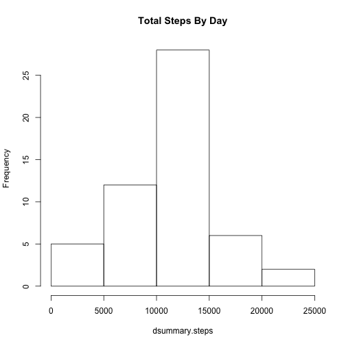
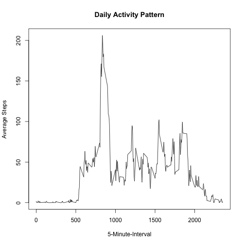
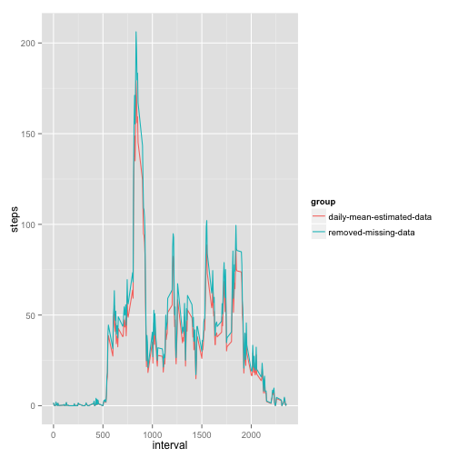

Reproducible Research  Programming Assigment 1
========================================================

### Introduction

This Programming Assignment 1 is described at: [coursera Reproducible Research PA 1](https://class.coursera.org/repdata-011/human_grading/view/courses/973512/assessments/3/submissions)

### Loading and preprocessing the data

Load data from url, unzip, translate data into R date object, and prepare for weekday/weekend comparisons.
  

```r
library(plyr)
library(downloader)
```

```
## Warning: package 'downloader' was built under R version 3.1.2
```

```r
downloader::download("https://d396qusza40orc.cloudfront.net/repdata%2Fdata%2Factivity.zip",
             "activity.zip", 
             mode = "wb")  
unzip("activity.zip", "activity.csv")
activity.df <- read.csv( "activity.csv", na.strings = "NA")
activity.df$date <- as.Date(activity.df$date, "%Y-%m-%d")
activity.cleaned.df <-activity.df[which(!is.na(activity.df$steps)),]
```

###  What is mean total number of steps taken per day?

Histogram number of total steps per day


```r
dsummary.steps <- tapply(activity.cleaned.df$steps, activity.cleaned.df$date, sum, na.rm = TRUE)

hist(dsummary.steps, main="Total Steps By Day")
```

 

Calculation | Total Daily Steps
------------ | -----
Overall Mean | 10766.19
Overall Median Steps | 10765.00

### What is the average daily activity pattern?


```r
daily.df <- ddply(activity.cleaned.df, "interval", summarise, steps=mean(steps))
plot( y = daily.df$steps, x = daily.df$interval, type = "l", 
     xlab = "5-Minute-Interval", 
     ylab = "Average Steps", 
     main = "Daily Activity Pattern")
```

 

```r
str(daily.df)
```

```
## 'data.frame':	288 obs. of  2 variables:
##  $ interval: int  0 5 10 15 20 25 30 35 40 45 ...
##  $ steps   : num  1.717 0.3396 0.1321 0.1509 0.0755 ...
```

What interval shows as having the max actvity

**Max step during a 5-min interval:** 2355

### Inputing missing values

For instructional purposes of this exercise, I am choosing to pick the mean for the day to fill in missing values of "NA"


```r
activity.est.df <- activity.df 
mean.df <- ddply(activity.df, "date", summarise, steps=mean(steps))
mean.df[is.na(mean.df$steps),"steps"] <- 0
for ( i in 1:nrow(activity.est.df)) {
  if (is.na(activity.est.df[i,"steps"])) {
    dt    <- activity.est.df[i,"date"]
    steps <- mean.df[mean.df$date == dt,"steps"]
    activity.est.df[i,"steps"] <- steps
    }
}
```

Let's see what the get using this strategy


```r
library(ggplot2)
daily.est.df <- ddply(activity.est.df, "interval", summarise, steps=mean(steps))
daily.est.df$group <- "daily-mean-estimated-data"
daily.df$group <- "removed-missing-data"

daily.combined.df <- rbind( daily.est.df, daily.df)
daily.combined.df$group <- as.factor(daily.combined.df$group)

ggplot(data=daily.combined.df, aes(x=interval, y=steps, group=group, colour=group)) + geom_line()
```

 


###  Are there differences in activity patterns between weekdays and weekends?


```r
activity.est.df$day.of.week <- format(activity.est.df$date, "%a")
dow.est.df <- ddply(activity.est.df, "day.of.week", summarise, daily.sum=sum(steps))
dow.est.df$day.type <- dow.est.df$day.of.week
dow.est.df$day.type[which(dow.est.df$day.type %in% c("Sat","Sun"))] <- "Weekend"
dow.est.df$day.type[which(dow.est.df$day.type %in% c("Mon","Tue","Wed","Thu","Fri"))] <- "Weekday"
dow.est.df$day.type <- as.factor(dow.est.df$day.type)
dow.est.df 
```

```
##   day.of.week daily.sum day.type
## 1         Fri     86518  Weekday
## 2         Mon     69824  Weekday
## 3         Sat     87748  Weekend
## 4         Sun     85944  Weekend
## 5         Thu     65702  Weekday
## 6         Tue     80546  Weekday
## 7         Wed     94326  Weekday
```

```r
weekend.est.df <- ddply(dow.est.df, "day.type", summarise, mean.steps=mean(daily.sum))

formatted.mean.weekdays <- sprintf("%.2f",weekend.est.df[weekend.est.df$day.type=="Weekday","mean.steps"])
formatted.mean.weekends <- sprintf("%.2f",weekend.est.df[weekend.est.df$day.type=="Weekend","mean.steps"])
```

Summary information on steps on weekdays versus weekends.

* Uses data with filled in missing interval data (filled in with interval mean for that day)
* Determines sum of steps across days of the week
* Determines mean of weekday versus weekend activity

 . | Mean Daily Steps
------------ | -----
 Mean Weekdays| 79383.20
 Mean Weekends | 86846.00
