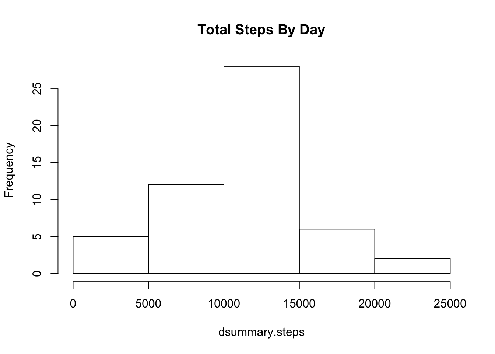
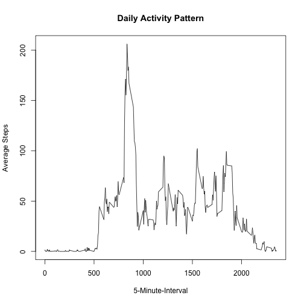
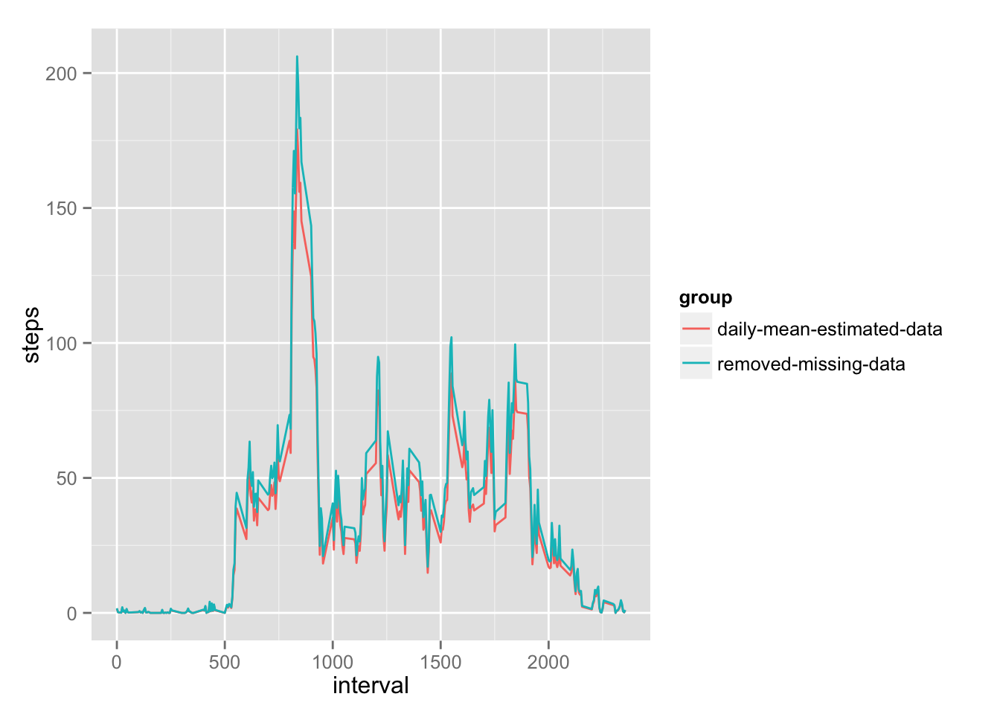
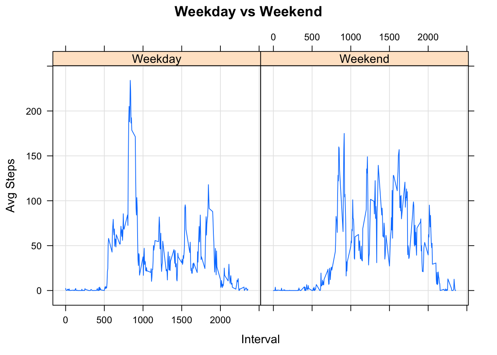

Reproducible Research  Programming Assigment 1
========================================================

### Introduction

This Programming Assignment 1 is described at: [coursera Reproducible Research PA 1](https://class.coursera.org/repdata-011/human_grading/view/courses/973512/assessments/3/submissions)

### Loading and preprocessing the data

Load data from url, unzip, translate data into R date object, and prepare for weekday/weekend comparisons.  Also adding attributes so that data can be analyzed by day of week and weekday/weekend.  First, approach for getting a clean data set is to ignore records that are missing step readings.
  

```r
library(plyr)
library(downloader)
knitr::opts_chunk$set(fig.path=NA)
downloader::download("https://d396qusza40orc.cloudfront.net/repdata%2Fdata%2Factivity.zip",
             "activity.zip", 
             mode = "wb")  
unzip("activity.zip", "activity.csv")
activity.df <- read.csv( "activity.csv", na.strings = "NA")
activity.df$date <- as.Date(activity.df$date, "%Y-%m-%d")
#
# Let's add day of week information that will be valuable later
activity.df$day.of.week <- format(activity.df$date, "%a")
activity.df$day.type <- activity.df$day.of.week
activity.df$day.type[which(activity.df$day.type %in% c("Sat","Sun"))] <- "Weekend"
activity.df$day.type[which(activity.df$day.type %in% c("Mon","Tue","Wed","Thu","Fri"))] <- "Weekday"
activity.df$day.type <- as.factor(activity.df$day.type)
#
# Initial approach is the get rid of records that are missing step information
activity.cleaned.df <-activity.df[which(!is.na(activity.df$steps)),]
head(activity.df)
```

```
##   steps       date interval day.of.week day.type
## 1    NA 2012-10-01        0         Mon  Weekday
## 2    NA 2012-10-01        5         Mon  Weekday
## 3    NA 2012-10-01       10         Mon  Weekday
## 4    NA 2012-10-01       15         Mon  Weekday
## 5    NA 2012-10-01       20         Mon  Weekday
## 6    NA 2012-10-01       25         Mon  Weekday
```

###  What is mean total number of steps taken per day?

Histogram number of total steps per day


```r
dsummary.steps <- tapply(activity.cleaned.df$steps, 
                         activity.cleaned.df$date, 
                         sum, na.rm = TRUE)

hist(dsummary.steps, main="Total Steps By Day")
```

 

```r
library(ggplot2)
```

Calculation | Total Daily Steps
------------ | -----
Overall Mean | 10766.19
Overall Median Steps | 10765.00

### What is the average daily activity pattern?


```r
daily.df <- ddply(activity.cleaned.df, "interval", summarise, steps=mean(steps))
plot( y = daily.df$steps, x = daily.df$interval, type = "l", 
     xlab = "5-Minute-Interval", 
     ylab = "Average Steps", 
     main = "Daily Activity Pattern")
```

 

```r
str(daily.df)
```

```
## 'data.frame':	288 obs. of  2 variables:
##  $ interval: int  0 5 10 15 20 25 30 35 40 45 ...
##  $ steps   : num  1.717 0.3396 0.1321 0.1509 0.0755 ...
```

What interval shows as having the max actvity

**Max step during a 5-min interval:** 2355

### Inputing missing values

For instructional purposes of this exercise, I am choosing to pick the mean for the day to fill in missing values of "NA"


```r
activity.est.df <- activity.df 
mean.df <- ddply(activity.df, "date", summarise, steps=mean(steps))
mean.df[is.na(mean.df$steps),"steps"] <- 0
for ( i in 1:nrow(activity.est.df)) {
  if (is.na(activity.est.df[i,"steps"])) {
    dt    <- activity.est.df[i,"date"]
    steps <- mean.df[mean.df$date == dt,"steps"]
    activity.est.df[i,"steps"] <- steps
    }
}
```

Let's see what the get using this strategy


```r
library(ggplot2)
daily.est.df <- ddply(activity.est.df, "interval", summarise, steps=mean(steps))
daily.est.df$group <- "daily-mean-estimated-data"
daily.df$group <- "removed-missing-data"

daily.combined.df <- rbind( daily.est.df, daily.df)
daily.combined.df$group <- as.factor(daily.combined.df$group)
```

### Histogram using Estimate Strategy
First, let's display histogram as requested as part of this assignment

```r
dsummary.steps <- tapply(activity.cleaned.df$step, activity.cleaned.df$date, sum, na.rm = TRUE)

hist(dsummary.steps, main="Total Steps By Day")
```

 

#### Supplemental information
For informational purposes consider this overlay of result data showing i) removal of missing values with ii) using the mean per day estimate strategy.


```r
ggplot(data=daily.combined.df, aes(x=interval, y=steps, group=group, colour=group)) + geom_line()
```

 


###  Are there differences in activity patterns between weekdays and weekends?

For this step let's return to using the original data set and removing records that are missing data. 


```r
dow.df <- ddply(activity.df, "day.of.week", summarise, daily.sum=sum(steps))
summary(dow.df) 
```

```
##  day.of.week          daily.sum    
##  Length:7           Min.   :80546  
##  Class :character   1st Qu.:80546  
##  Mode  :character   Median :80546  
##                     Mean   :80546  
##                     3rd Qu.:80546  
##                     Max.   :80546  
##                     NA's   :6
```

```r
dow.df$day.type <- dow.df$day.of.week
dow.df$day.type[which(dow.df$day.type %in% c("Sat","Sun"))] <- "Weekend"
dow.df$day.type[which(dow.df$day.type %in% c("Mon","Tue","Wed","Thu","Fri"))] <- "Weekday"
dow.df$day.type <- as.factor(dow.df$day.type)
```

### Panel Plot on 5 min intervals comparing weekday to weekend data

```r
versus.df <- ddply(activity.cleaned.df, c("interval", "day.type"), summarise, steps=mean(steps))
#head(versus.df)
library(lattice)
xyplot(steps~interval | factor(day.type), data=versus.df, pch=19,
                main="Weekday vs Weekend", xlab="Interval",  ylab="Avg Steps",layout=c(2,1),type=c("l","g"))
```

 

#### High level summary of weekday versus weekend
Summary information on steps on weekdays versus weekends.


```r
summary.df <- ddply(versus.df, "day.type", summarise, steps=sum(steps))
formatted.mean.weekdays <- sprintf("%.2f",summary.df[summary.df$day.type=="Weekday","steps"])
formatted.mean.weekends <- sprintf("%.2f",summary.df[summary.df$day.type=="Weekend","steps"])
```
* Determine mean of weekday versus weekend activity

 . | Mean Daily Steps
------------ | -----
 Mean Weekdays| 10177.33
 Mean Weekends | 12406.57
